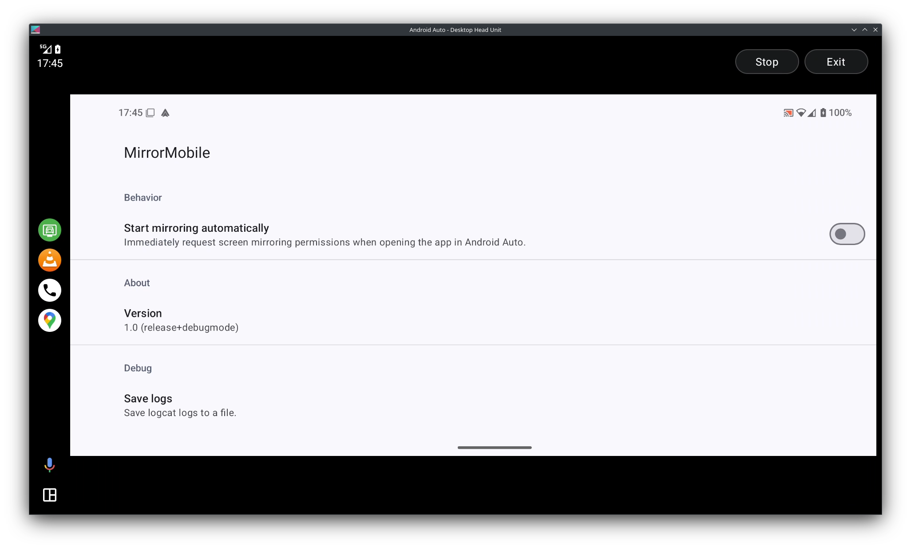

# MirrorMobile


MirrorMobile (pun intended) is a simple app for mirroring an Android device's screen to Android Auto. It tries to turn the vehicle's display into a plain old monitor. Input via the car's touchscreen is not supported.

**NOTE**: This is a personal project. I will not add workarounds that aren't needed for my Android device and car.



## Features

* Supports Android 10 and newer
* Pauses screen mirroring when the car is driven
    * This is intentional and there is no option to turn this behavior off
    * **NOTE**: If the vehicle doesn't report its speed to Android Auto, then MirrorMobile can't be used at all

## Limitations

* No support for touchscreen input
    * There are no plans to add support for touchscreen input until it can be done in a way that is indistinguishable from interacting with the phone screen. This means multi-touch works, there are separate press and release events, there are no artificial delays, and input events aren't converted into timed gestures. Currently, the only way to receive raw input events from Android Auto is if the app is built with a leaked proprietary Android Auto SDK. For obvious reasons, MirrorMobile will never use this and unfortunately, Google is unlikely to ever expose raw input events in the official AndroidX Car library.

* Split screen side panel overlaps screen mirroring
    * Android Auto's rendering surface does not actually get resized when split screen is enabled and Android's screen capture API does not support rendering into a portion of a surface. This is not possible to fix.
    * To close the split screen side panel and enter full screen mode, press on MirrorMobile's icon in Android Auto's launcher bar again.

* Last displayed frame remains visible after stopping screen mirroring
    * At least in Android 15, after stopping the screen capture and detaching the rendering surface from it, attempting to draw on the surface (to clear it) causes a crash. This is not possible to fix.

* Notifications are hidden when screen mirroring is active
    * This behavior is controlled by Android and there is no way to turn it off. However, on Android 14 and newer, when mirroring a single app, notifications will not be hidden.

* Plenty of UI jank
  * Aside from the actual screen mirroring, all UI elements (buttons, messages, etc.) are rendered by Android Auto. MirrorMobile only provides Android Auto with a template and it renders the actual elements how it sees fit. Unfortunately, it can sometimes be quite buggy, causing things like:

    * Disabled buttons appearing as if they're enabled
    * The left portion of the leftmost button being cut off
    * Messages being shown after a delay instead of immediately
    * Minor flickering when updating the screen layout

    These are Android Auto bugs and can't be worked around in MirrorMobile.

## Usage

1. Install the latest version from the [releases page](https://github.com/chenxiaolong/MirrorMobile/releases). To verify the digital signature, see the [verifying digital signatures](#verifying-digital-signatures) section.

2. MirrorMobile is what's referred to as a "template" app. Android Auto will refuse to load template apps unless the host is in development mode or the app was installed from the Play Store.

    * On unrooted devices, the only reliable option is to use a wireless Android Auto dongle that supports development mode.
    * On rooted devices, tools like [AlterInstaller](https://github.com/chenxiaolong/AlterInstaller) can be used to spoof where MirrorMobile was installed from.

3. Open MirrorMobile and grant it the necessary permissions, either on the phone or in Android Auto.

## Permissions

MirrorMobile requires two permissions:

* `POST_NOTIFICATIONS`: This is required to keep the screen mirroring process alive in a foreground service.

* `CAR_SPEED`: This is required to get the vehicle's speed from Android Auto so that the screen mirroring process can be paused when driving. In the permission prompt, Android Auto categorizes this as a location permission, but MirrorMobile receives nothing more than the vehicle's speed in meters per second. It does not receive the GPS location. This can be confirmed by going to Android's Settings -> Apps -> MirrorMobile -> (3 dots) -> All permissions, where the permission shows as `car speed`.

  Android Auto internally is aware if the vehicle is parked or shifted in gear, but does not expose this to applications. If it ever does, MirrorMobile will be updated to use that and this permission will be removed.

MirrorMobile does not and will never have network or file access permissions.

## Verifying digital signatures

First, use `apksigner` to print the digests of the APK signing certificate:

```
apksigner verify --print-certs MirrorMobile-<version>-release.apk
```

Then, check that the SHA-256 digest of the APK signing certificate is:

```
d58c61d0080c273a9d906580b8bc2442550a3084de23358cacf8861252fba9ea
```

## Building from source

MirrorMobile can be built like most other Android apps using Android Studio or the gradle command line.

To build the APK:

```bash
./gradlew assembleDebug
```

The APK will be signed with the default autogenerated debug key.

To create a release build with a specific signing key, set the following environment variables:

```bash
export RELEASE_KEYSTORE=/path/to/keystore.jks
export RELEASE_KEY_ALIAS=alias_name

read -r -s RELEASE_KEYSTORE_PASSPHRASE
read -r -s RELEASE_KEY_PASSPHRASE
export RELEASE_KEYSTORE_PASSPHRASE
export RELEASE_KEY_PASSPHRASE
```

and then build the release APK:

```bash
./gradlew assembleRelease
```

## Contributing

Bug fix and translation pull requests are welcome and much appreciated!

New features are currently not accepted. I don't want MirrorMobile to do anything more than what would happen if a regular external monitor were plugged into the device.

## License

MirrorMobile is licensed under GPLv3. Please see [`LICENSE`](./LICENSE) for the full license text.

Unlike similar projects, MirrorMobile does not use the leaked proprietary Android Auto SDK. All dependencies are fully open source.
